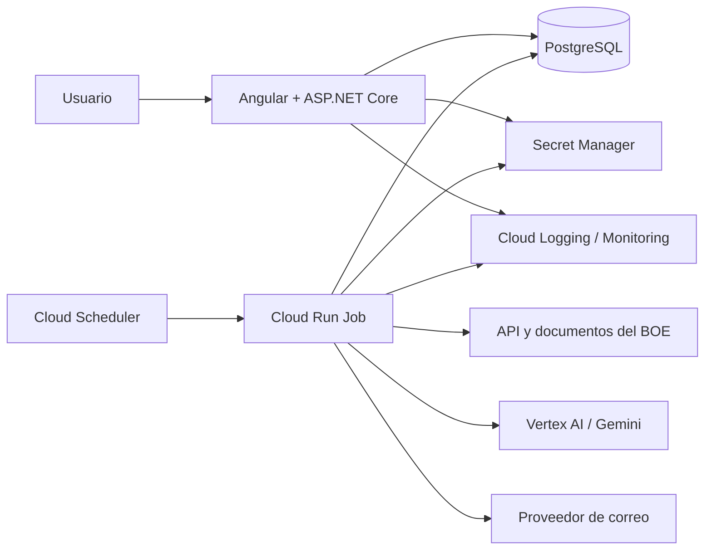
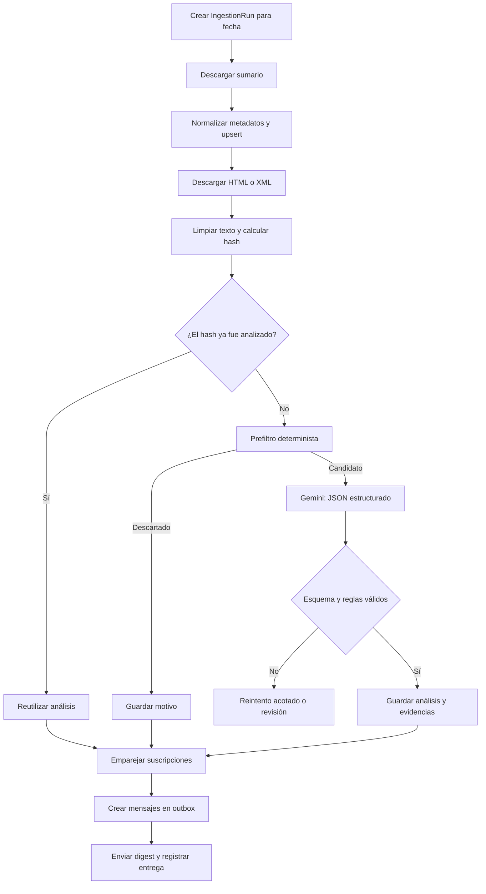

# Arquitectura

## 1. Decisión principal

Se usará un **monolito modular** en un único repositorio, con dos puntos de
entrada desplegables:

1. **Web/API**: sirve la aplicación Angular y la API HTTP.
2. **Worker de ingesta**: ejecuta el pipeline diario y termina.

Comparten dominio, casos de uso, persistencia y adaptadores, pero no el ciclo de
vida. Esta separación permite escalar la lectura y el procesamiento por
separado sin introducir microservicios, colas ni consistencia distribuida antes
de necesitarlos.

## 2. Vista del sistema



## 3. Módulos funcionales

| Módulo | Responsabilidad | No debe conocer |
|---|---|---|
| Sources | Obtener y normalizar sumarios y documentos oficiales | Gemini, usuarios, correo |
| Radar | Clasificar, extraer datos y decidir qué análisis publicar | Angular, proveedor de correo |
| Catalog | Consultar publicaciones, buscar y filtrar | Detalles del cliente BOE o Gemini |
| Subscriptions | Gestionar correo verificado y preferencias | Parsing del BOE |
| Alerts | Emparejar análisis con suscripciones y entregar digests | Detalles del cliente Gemini |
| Operations | Ejecuciones, reintentos, métricas y diagnóstico | Reglas de presentación |

Cada módulo expone casos de uso y contratos; no se accede a sus tablas desde
otro módulo salvo mediante esos contratos. Al principio todos pueden compartir
una base y un `DbContext`, pero sus configuraciones y namespaces estarán
separados.

## 4. Pipeline de ingesta



### Reglas de ejecución

- La clave externa del documento y el hash de contenido hacen la ingesta
  idempotente.
- El estado se confirma documento por documento; un fallo no invalida todo el
  día.
- La llamada a Gemini usa temperatura baja y un esquema JSON versionado.
- Un plazo solo se publica cuando incluye evidencia textual; si no, queda como
  no determinado.
- Los reintentos tienen límite y backoff. Tras agotarlos el elemento queda
  visible en operaciones.
- El digest se genera mediante outbox transaccional; el identificador de
  entrega impide enviar dos veces la misma coincidencia.

## 5. Estructura prevista del repositorio

```text
boe-radar-ia/
├── src/
│   ├── BoeRadar.Web/                 # API, auth mínima y hosting de Angular
│   ├── BoeRadar.Worker/              # comando de ingesta y alertas
│   ├── BoeRadar.Domain/              # entidades, value objects y reglas puras
│   ├── BoeRadar.Application/         # casos de uso y puertos
│   ├── BoeRadar.Infrastructure/       # EF Core, BOE, Gemini, correo
│   └── boe-radar-ui/                 # Angular
├── tests/
│   ├── BoeRadar.UnitTests/
│   ├── BoeRadar.IntegrationTests/
│   └── BoeRadar.ArchitectureTests/
├── deploy/
│   └── terraform/                    # infraestructura GCP
├── docs/
└── docker-compose.yml                # desarrollo local
```

## 6. Tecnologías y motivos

| Área | Elección inicial | Motivo |
|---|---|---|
| Backend | ASP.NET Core sobre .NET 10 LTS | Stack principal del autor, rendimiento y soporte prolongado |
| Frontend | Angular 22 | Versión estable con soporte activo en el inicio del proyecto |
| Persistencia | PostgreSQL + EF Core | SQL, JSONB y búsqueda full-text sin otro motor |
| IA | Gemini en Vertex AI | Salida estructurada, experiencia previa y operación en GCP |
| Ejecución web | Cloud Run | Contenedores administrados y escala a cero |
| Lotes | Cloud Run Jobs + Scheduler | Encaja con una ejecución diaria finita |
| Secretos | Secret Manager | Credenciales fuera del repositorio y de las imágenes |
| Observabilidad | OpenTelemetry + Cloud Logging/Monitoring | Trazas, métricas y logs portables |
| Infraestructura | Terraform | Despliegue reproducible y demostrable en portafolio |

No se incorpora Redis, Elasticsearch, Kafka, Pub/Sub ni una base vectorial en
el MVP. PostgreSQL cubre el volumen y las consultas iniciales. Cloud Tasks o
Pub/Sub serán el primer paso si el procesamiento por lotes deja de ser fiable o
necesita más paralelismo.

## 7. Contratos principales

```csharp
public interface IOfficialGazetteSource
{
    Task<IReadOnlyList<SourceItem>> GetIssueAsync(
        DateOnly publicationDate,
        CancellationToken cancellationToken);

    Task<SourceContent> GetContentAsync(
        SourceItem item,
        CancellationToken cancellationToken);
}

public interface IDocumentAnalyzer
{
    Task<AnalysisResult> AnalyzeAsync(
        AnalysisInput input,
        CancellationToken cancellationToken);
}

public interface IAlertSender
{
    Task<DeliveryResult> SendDigestAsync(
        AlertDigest digest,
        CancellationToken cancellationToken);
}
```

El adaptador `BoeSource` implementa la primera interfaz. Añadir BORME u otra
fuente no debe modificar el pipeline, solo aportar otro adaptador y su mapeo.

## 8. API HTTP inicial

| Método y ruta | Uso |
|---|---|
| `GET /api/v1/publications` | Listado paginado con búsqueda y filtros |
| `GET /api/v1/publications/{id}` | Ficha, evidencias y enlaces oficiales |
| `GET /api/v1/facets` | Valores disponibles para filtros |
| `POST /api/v1/subscriptions` | Iniciar suscripción y verificación de correo |
| `GET /api/v1/subscriptions/verify` | Confirmar token de correo |
| `PUT /api/v1/subscriptions/{token}` | Cambiar preferencias mediante enlace seguro |
| `DELETE /api/v1/subscriptions/{token}` | Dar de baja la suscripción |
| `GET /health/live` | Vida del proceso |
| `GET /health/ready` | Base de datos y dependencias indispensables |

Los endpoints internos de ingesta no serán públicos: Cloud Scheduler ejecutará
un Job mediante identidad de servicio. En desarrollo se expondrá el mismo caso
de uso como comando local.

## 9. Seguridad y privacidad

- No guardar más datos personales que correo, preferencias y consentimientos.
- Cifrar en tránsito y en reposo; secretos solo en Secret Manager.
- Guardar hash de los tokens de verificación/gestión, nunca el token en claro.
- Caducar tokens y aplicar rate limiting a altas y verificaciones.
- Sanitizar el HTML externo; la UI no renderiza contenido del BOE sin limpiar.
- Tratar el texto de la fuente como datos no confiables también frente a prompt
  injection; el modelo solo puede devolver el esquema definido.
- No enviar correos a direcciones no verificadas.
- Incluir baja inmediata y registro de consentimiento.

## 10. Calidad y observabilidad

### Pruebas

- Unitarias: reglas de prefiltrado, matching, plazos y estados.
- Contrato: respuestas del BOE guardadas como fixtures.
- Integración: PostgreSQL real mediante contenedor y adaptadores simulados.
- Golden set: clasificación/extracción sobre documentos etiquetados.
- E2E: publicación visible y digest generado a partir de un sumario fixture.
- Arquitectura: dependencias entre módulos y capas.

### Señales operativas

- documentos descubiertos, descargados, candidatos, relevantes y fallidos;
- duración y antigüedad de la última ingesta exitosa;
- tokens, latencia y coste estimado de IA por documento;
- respuestas inválidas del modelo y reintentos;
- digests creados, enviados, rechazados y duplicados evitados.

## 11. Evolución prevista

1. Paralelizar análisis con Cloud Tasks o Pub/Sub si la ventana diaria crece.
2. Separar el worker como servicio autónomo solo si tiene un ciclo de despliegue
   o escalado distinto de forma sostenida.
3. Añadir `pgvector` cuando una función concreta de similitud o RAG demuestre
   valor; no antes.
4. Incorporar nuevas fuentes mediante `IOfficialGazetteSource` y conservar el
   identificador de procedencia en todas las entidades.
