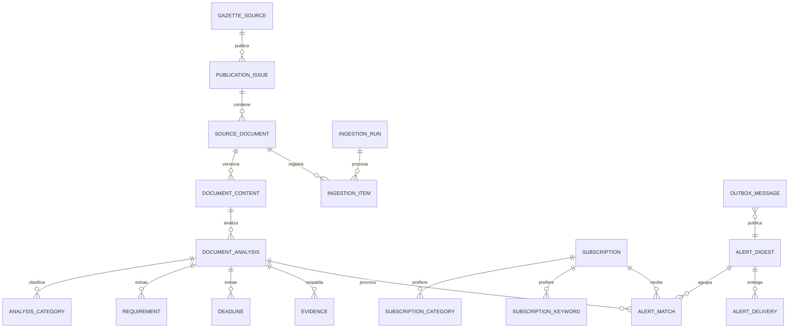

# Modelo de datos

## 1. Objetivos

El modelo separa tres tipos de verdad:

1. **Fuente**: lo que publicó el organismo oficial.
2. **Análisis**: interpretación versionada producida por el pipeline.
3. **Entrega**: por qué una publicación coincidió con una suscripción y cuándo
   se notificó.

Esta separación permite reanalizar un documento con un prompt o modelo nuevo
sin sobrescribir la fuente ni volver a enviar alertas accidentalmente.

## 2. Diagrama conceptual

## 3. Tablas de fuente

### `gazette_sources`

| Campo | Tipo | Notas |
|---|---|---|
| `id` | uuid | PK |
| `code` | varchar(32) | Único; inicialmente `BOE` |
| `name` | varchar(200) | Nombre visible |
| `base_url` | text | Dominio oficial |
| `is_active` | boolean | Habilita la ingesta |
| `created_at` | timestamptz | Auditoría |

### `publication_issues`

| Campo | Tipo | Notas |
|---|---|---|
| `id` | uuid | PK |
| `source_id` | uuid | FK a `gazette_sources` |
| `external_id` | varchar(100) | Número o ID de la edición |
| `publication_date` | date | Fecha oficial |
| `source_url` | text | URL del sumario |
| `raw_metadata` | jsonb | Respuesta original relevante |
| `discovered_at` | timestamptz | Primera importación |

Índice único: `(source_id, publication_date, external_id)`.

### `source_documents`

Representa una entrada estable del sumario.

| Campo | Tipo | Notas |
|---|---|---|
| `id` | uuid | PK |
| `issue_id` | uuid | FK a `publication_issues` |
| `source_id` | uuid | Desnormalizado para claves y consultas |
| `external_id` | varchar(100) | Identificador BOE, único por fuente |
| `title` | text | Título oficial |
| `department` | varchar(300) | Organismo/departamento publicado |
| `section_code` | varchar(30) | Sección y subsección |
| `rank` | varchar(100) | Rango si la fuente lo ofrece |
| `official_html_url` | text | Nullable |
| `official_xml_url` | text | Nullable |
| `official_pdf_url` | text | Referencia oficial auténtica |
| `publication_date` | date | Facilita filtros |
| `raw_metadata` | jsonb | Metadatos de origen no normalizados |
| `created_at` | timestamptz | Auditoría |
| `updated_at` | timestamptz | Auditoría |

Índice único: `(source_id, external_id)`. Índices por `publication_date`,
`section_code` y `department`.

### `document_contents`

Permite detectar y conservar cambios de contenido.

| Campo | Tipo | Notas |
|---|---|---|
| `id` | uuid | PK |
| `document_id` | uuid | FK a `source_documents` |
| `content_hash` | char(64) | SHA-256 del texto canónico |
| `format` | varchar(20) | `xml`, `html` o texto derivado |
| `normalized_text` | text | Texto limpio analizable |
| `storage_uri` | text | Opcional para copia cruda en object storage |
| `fetched_at` | timestamptz | Momento de descarga |
| `is_current` | boolean | Una versión actual por documento |

Índices únicos: `(document_id, content_hash)` y uno parcial para una sola fila
`is_current = true` por documento. El MVP no necesita almacenar el PDF porque
mantiene su enlace oficial.

## 4. Tablas de análisis

### `document_analyses`

| Campo | Tipo | Notas |
|---|---|---|
| `id` | uuid | PK |
| `content_id` | uuid | FK a `document_contents` |
| `pipeline_version` | varchar(50) | Versión conjunta de reglas y esquema |
| `prompt_version` | varchar(50) | Prompt utilizado |
| `model_provider` | varchar(50) | `vertex-ai` |
| `model_name` | varchar(100) | Modelo exacto |
| `status` | varchar(30) | Estado del flujo |
| `is_relevant` | boolean | Decisión final |
| `relevance_score` | numeric(5,4) | De 0 a 1 |
| `confidence_score` | numeric(5,4) | De 0 a 1 |
| `summary` | text | Resumen breve |
| `why_it_matters` | text | Aplicación potencial |
| `potential_recipients` | text | Lenguaje no concluyente |
| `geographic_scope` | varchar(200) | Nacional, CCAA, provincia, etc. |
| `issuer` | varchar(300) | Organismo normalizado |
| `effective_from` | date | Nullable; solo si está respaldado |
| `requires_review` | boolean | Ambigüedad o baja confianza |
| `discard_reason` | varchar(100) | Motivo de descarte, nullable |
| `raw_model_output` | jsonb | Diagnóstico y reproducibilidad |
| `input_tokens` | integer | Coste/operación |
| `output_tokens` | integer | Coste/operación |
| `analyzed_at` | timestamptz | Auditoría |
| `published_at` | timestamptz | Nullable |

Índice único: `(content_id, pipeline_version)`. Solo una versión se marca como
publicada mediante una restricción o estado de dominio.

Estados propuestos: `pending`, `prefiltered_out`, `analyzing`, `validated`,
`published`, `needs_review`, `failed`.

### `analysis_categories`

| Campo | Tipo | Notas |
|---|---|---|
| `analysis_id` | uuid | FK y parte de PK |
| `category` | varchar(40) | Parte de PK |
| `score` | numeric(5,4) | Confianza por categoría |
| `is_primary` | boolean | Una principal |

Valores iniciales: `grant`, `tax`, `compliance`, `labor`,
`public_procurement`, `other`.

### `requirements`

| Campo | Tipo | Notas |
|---|---|---|
| `id` | uuid | PK |
| `analysis_id` | uuid | FK |
| `kind` | varchar(40) | Beneficiario, tamaño, sector, ubicación... |
| `description` | text | Requisito sin inferencias adicionales |
| `ordinal` | integer | Orden visible |

### `deadlines`

| Campo | Tipo | Notas |
|---|---|---|
| `id` | uuid | PK |
| `analysis_id` | uuid | FK |
| `kind` | varchar(40) | Solicitud, entrada en vigor, cumplimiento... |
| `label` | text | Texto legible |
| `starts_on` | date | Nullable |
| `ends_on` | date | Nullable |
| `relative_expression` | text | Ej. «20 días desde la publicación» |
| `calculation_status` | varchar(30) | `explicit`, `derived`, `unresolved` |
| `ordinal` | integer | Orden visible |

No se calcula automáticamente una fecha jurídica compleja en el MVP. Las
expresiones relativas se conservan y se muestran como tales.

### `evidences`

| Campo | Tipo | Notas |
|---|---|---|
| `id` | uuid | PK |
| `analysis_id` | uuid | FK |
| `target_type` | varchar(30) | `summary`, `requirement`, `deadline`, etc. |
| `target_id` | uuid | Nullable para campos del análisis |
| `quote` | text | Fragmento breve de la fuente |
| `start_offset` | integer | Nullable; posición en texto canónico |
| `end_offset` | integer | Nullable |
| `source_anchor` | varchar(200) | Artículo, apartado o ancla, si existe |

Para `deadline` y `requirement` debe existir al menos una evidencia antes de
publicar. La cita es breve y se usa como prueba contextual, no para reproducir
el documento completo.

## 5. Suscripciones y alertas

### `subscriptions`

| Campo | Tipo | Notas |
|---|---|---|
| `id` | uuid | PK |
| `email` | citext | Único normalizado |
| `status` | varchar(30) | `pending`, `active`, `unsubscribed`, `bounced` |
| `verification_token_hash` | char(64) | Nullable y con expiración |
| `management_token_hash` | char(64) | Token largo rotatorio |
| `token_expires_at` | timestamptz | Nullable |
| `timezone` | varchar(60) | Inicialmente `Europe/Madrid` |
| `digest_hour` | smallint | Restricción 0-23 |
| `consented_at` | timestamptz | Evidencia de consentimiento |
| `verified_at` | timestamptz | Nullable |
| `unsubscribed_at` | timestamptz | Nullable |
| `created_at` | timestamptz | Auditoría |

### `subscription_categories`

PK compuesta `(subscription_id, category)`. Permite varias categorías sin
guardar arrays opacos.

### `subscription_keywords`

| Campo | Tipo | Notas |
|---|---|---|
| `id` | uuid | PK |
| `subscription_id` | uuid | FK |
| `keyword` | varchar(100) | Normalizada |
| `match_mode` | varchar(20) | Inicialmente `contains` |

### `alert_matches`

Explica por qué un análisis entra en un digest.

| Campo | Tipo | Notas |
|---|---|---|
| `id` | uuid | PK |
| `subscription_id` | uuid | FK |
| `analysis_id` | uuid | FK |
| `digest_id` | uuid | FK nullable hasta agrupar |
| `match_reasons` | jsonb | Categorías/palabras coincidentes |
| `matched_at` | timestamptz | Auditoría |

Índice único: `(subscription_id, analysis_id)`.

### `alert_digests`

| Campo | Tipo | Notas |
|---|---|---|
| `id` | uuid | PK |
| `subscription_id` | uuid | FK |
| `digest_date` | date | Fecha local del digest |
| `status` | varchar(30) | `pending`, `sent`, `failed`, `skipped` |
| `item_count` | integer | Contador comprobable |
| `created_at` | timestamptz | Auditoría |
| `sent_at` | timestamptz | Nullable |

Índice único: `(subscription_id, digest_date)`.

### `alert_deliveries`

| Campo | Tipo | Notas |
|---|---|---|
| `id` | uuid | PK |
| `digest_id` | uuid | FK |
| `provider` | varchar(50) | Proveedor utilizado |
| `idempotency_key` | varchar(200) | Única |
| `provider_message_id` | varchar(200) | Nullable |
| `status` | varchar(30) | Estado de entrega |
| `attempt_count` | integer | Reintentos |
| `last_error` | text | Nullable y sin datos sensibles |
| `updated_at` | timestamptz | Auditoría |

## 6. Operación y fiabilidad

### `ingestion_runs`

| Campo | Tipo | Notas |
|---|---|---|
| `id` | uuid | PK |
| `source_id` | uuid | FK |
| `target_date` | date | Fecha solicitada |
| `trigger` | varchar(30) | `scheduled`, `manual`, `backfill` |
| `status` | varchar(30) | `running`, `completed`, `partial`, `failed` |
| `started_at` | timestamptz | Auditoría |
| `finished_at` | timestamptz | Nullable |
| `counters` | jsonb | Totales operativos |
| `error_summary` | text | Nullable |

### `ingestion_items`

| Campo | Tipo | Notas |
|---|---|---|
| `id` | uuid | PK |
| `run_id` | uuid | FK |
| `document_id` | uuid | FK nullable hasta descubrir |
| `external_id` | varchar(100) | Identifica fallos tempranos |
| `stage` | varchar(30) | Etapa actual |
| `status` | varchar(30) | Estado |
| `attempt_count` | integer | Reintentos |
| `last_error_code` | varchar(100) | Clasificable |
| `last_error` | text | Sanitizado |
| `updated_at` | timestamptz | Auditoría |

### `outbox_messages`

| Campo | Tipo | Notas |
|---|---|---|
| `id` | uuid | PK e idempotency key |
| `type` | varchar(100) | Tipo de evento |
| `payload` | jsonb | Datos mínimos necesarios |
| `occurred_at` | timestamptz | Creación |
| `processed_at` | timestamptz | Nullable |
| `attempt_count` | integer | Reintentos |
| `last_error` | text | Nullable |

Se escribe en la misma transacción que el cambio de negocio que origina la
notificación.

## 7. Reglas de integridad importantes

- Todas las fechas técnicas son UTC (`timestamptz`); las fechas jurídicas sin
  hora son `date`.
- Los identificadores internos no exponen significado; los IDs oficiales se
  conservan por separado.
- No se borra una fuente o análisis referenciado por una alerta enviada.
- Un documento puede tener varias versiones de contenido y análisis, pero solo
  una versión publicada en cada momento.
- Un análisis no pasa a `published` si su esquema es inválido o un requisito o
  plazo carece de evidencia.
- Un digest no incluye dos veces el mismo análisis para la misma suscripción.
- Los tokens se comparan por hash en tiempo constante y nunca aparecen en logs.

## 8. Estrategia de búsqueda

El MVP crea un `tsvector` español a partir de título, resumen, relevancia,
destinatarios y organismo, con índice GIN. Los filtros usan columnas e índices
normales. Si el corpus o la experiencia de búsqueda lo exigen, podrá añadirse
`pg_trgm` para tolerar errores y, más adelante, `pgvector`; ninguno es requisito
inicial.
